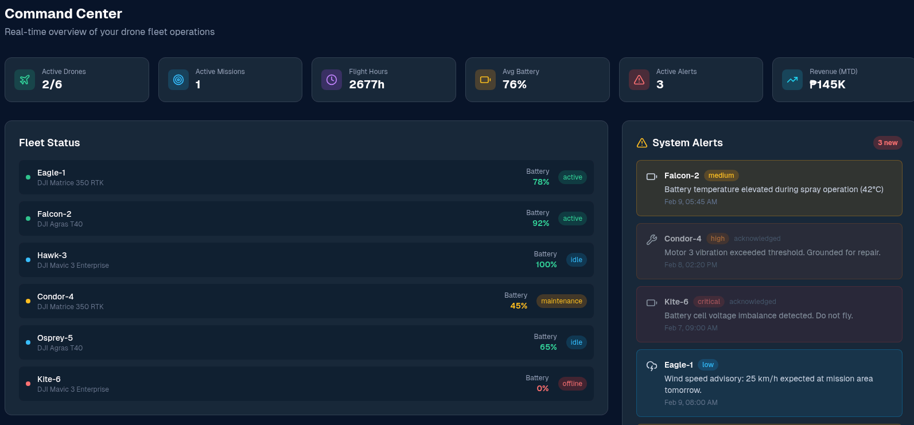

# DroneOps 🚁
### Industrial Drone Fleet Management Platform

DroneOps is a centralized platform for managing and monitoring industrial drone fleets in real time. It gives operators full visibility into drone operations, missions, maintenance status, and overall fleet performance — all in one place.

---

## 🧭 Project Overview

DroneOps was designed for drone operators who have outgrown manual coordination (spreadsheets, messaging apps, ad-hoc tools) but are not ready for expensive enterprise-grade aviation systems that take months to deploy and cost six figures.

The platform helps teams answer critical operational questions instantly:
- Which drones are currently flying?
- Which missions are scheduled or in progress?
- Which aircraft require maintenance?
- How efficiently is the fleet operating?

---

## ⚙️ Key Features

- 🚁 **Real-time fleet monitoring**
- 🗂️ **Mission scheduling and tracking**
- 🔧 **Predictive maintenance & service status**
- 📊 **Operational performance metrics**
- 🚨 **System alerts & safety warnings**
- 🗺️ **GPS-based drone positioning**
- 🧠 **AI-powered data analytics**
- 🧾 **Mission history and reporting**

---

## 🖥️ Command Center Dashboard

The main dashboard provides a real-time overview of fleet operations:

### Dashboard Modules
- **Active Drones** — drones currently in operation
- **Active Missions** — ongoing and scheduled flights
- **Flight Hours** — total accumulated flight time
- **Battery Health** — fleet-wide battery status
- **Fleet Status** — availability and readiness of each drone
- **System Alerts** — critical warnings and maintenance issues
- **Recent Missions** — progress, area, and mission status

---

## 🚨 System Alerts Examples

- Low battery during mission
- Vibration threshold exceeded
- Hardware malfunction detected
- Drone operating outside expected mission area
- Scheduled maintenance overdue

---

## 🛠️ Tech Stack

- **Frontend:** Next.js
- **Backend:** Node.js
- **Database:** PostgreSQL
- **AI / Analytics:** AI-driven operational analytics
- **Geolocation:** GPS integration
- **Domain:** Industrial drone operations

---

## 🎯 Target Users

- Industrial drone operators
- Infrastructure inspection companies
- Agriculture & surveying drone teams
- Energy, construction, and logistics sectors
- Mid-size drone service providers

---

## 📸 Screenshots

---

## 🚀 Project Goals

- Reduce operational overhead
- Improve fleet reliability and safety
- Enable data-driven decisions
- Scale drone operations efficiently

---

## 👨‍💻 Author

Developed by **Toropov Vitalii**
